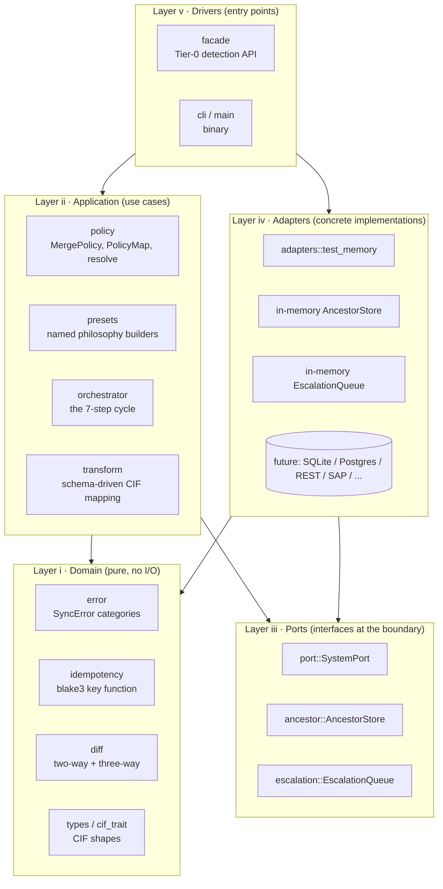
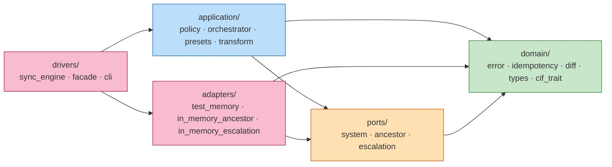
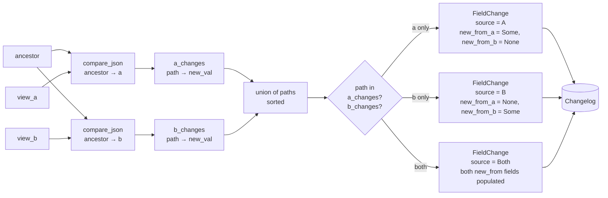
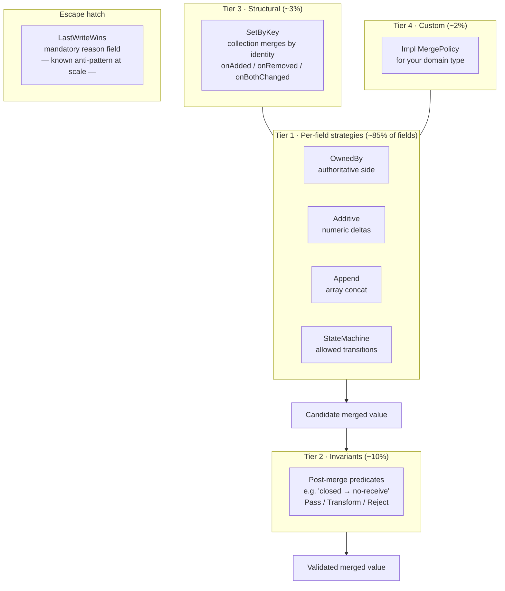

# diff-fusion architecture

> This document describes the Rust crate. File paths are relative to
> `src/` (e.g. `src/domain/…` means `src/src/domain/…`).

This document is the map. For *why* the design is shaped this way, read
`App.md`. For *how to work inside the code*, read `New claude.md`. This
file tells you where things live and how they fit together.

---

## Table of contents

- [§ 01 — The layer stack](#-01--the-layer-stack)
- [§ 02 — Module map](#-02--module-map)
- [§ 03 — The dependency rule](#-03--the-dependency-rule)
- [§ 04 — Data flow · the sync cycle](#-04--data-flow--the-sync-cycle)
- [§ 05 — Data flow · three-way diff](#-05--data-flow--three-way-diff)
- [§ 06 — Data flow · policy resolution](#-06--data-flow--policy-resolution)
- [§ 07 — The tiered policy stack](#-07--the-tiered-policy-stack)
- [§ 08 — Extension points](#-08--extension-points)
- [§ 09 — Non-negotiable invariants](#-09--non-negotiable-invariants)
- [§ 10 — Vocabulary](#-10--vocabulary)
- [§ 11 — Scaling: multiple systems and atomicity](#-11--scaling-multiple-systems-and-atomicity)

---

## § 01 — The layer stack

Clean Architecture in five concentric rings. Dependencies point inward.
Only the outermost ring changes per external system.



**The key architectural property:** `orchestrator` never imports from
`adapters`. The same cycle runs against `TestMemoryAdapter` (tests), a
future `SqliteAdapter`, or a real REST adapter — swapping backends does
not touch any application-layer code.

---

## § 02 — Module map

The directory mirrors the architecture. Each layer is its own
subdirectory; the `mod.rs` files document the layer's responsibility and
what it may depend on.

```
src/
├─ domain/              Pure computation, no I/O, no async
│  ├─ error.rs          SyncError { Transient, StaleWrite, Conflict }
│  ├─ idempotency.rs    hash(canonical_id + op + payload) → [u8; 32]
│  ├─ compare.rs        Two-way JSON diff (inner primitive)
│  ├─ diff/
│  │  ├─ mod.rs
│  │  └─ three_way.rs   Changelog with per-field source: A|B|Both
│  ├─ types.rs          CIF types, field definitions, schema trait
│  └─ cif_trait.rs      Legacy CIF schema trait
│
├─ application/         Use cases; depends on domain + ports
│  ├─ orchestrator.rs   Orchestrator, run_cycle_at, run_shadow
│  ├─ policy/
│  │  ├─ mod.rs         MergePolicy trait, PolicyMap, resolve()
│  │  ├─ owned_by.rs    Tier 1 · authoritative side
│  │  ├─ additive.rs    Tier 1 · counters
│  │  ├─ append.rs      Tier 1 · array concat
│  │  ├─ state_machine.rs   Tier 1 · enum transitions
│  │  ├─ escape_hatch.rs    LastWriteWins (mandatory reason)
│  │  ├─ invariants.rs  Tier 2 · post-merge predicates
│  │  ├─ structural.rs  Tier 3 · SetByKey collection merges
│  │  └─ declaration.rs Serde-ready policy declarations
│  ├─ presets.rs        one_way_from / prefer_system / …
│  └─ transform.rs      Schema-driven JSON → CIF
│
├─ ports/               Abstract interfaces at the boundary
│  ├─ system.rs         SystemPort, ExternalRef, Capabilities
│  ├─ ancestor.rs       AncestorStore trait + key/entry types
│  └─ escalation.rs     EscalationQueue trait + item type
│
├─ adapters/            Concrete port implementations
│  ├─ test_memory.rs          Reference SystemPort for tests
│  ├─ in_memory_ancestor.rs   InMemoryAncestorStore
│  ├─ in_memory_escalation.rs InMemoryEscalationQueue
│  └─ filesystem_ancestor.rs  FilesystemAncestorStore (durable, JSON files)
│
├─ drivers/             User-facing entry points
│  ├─ sync_engine.rs    SyncEngine facade (Tier-1 API)
│  ├─ facade.rs         DiffFusion (Tier-0 detection-only API)
│  ├─ cli.rs            Clap argument parsing
│  └─ wasm.rs           WASM kernel boundary driver
│
├─ lib.rs               Module tree + crate-root re-exports
└─ main.rs              Binary entry point
```

The split between trait and in-memory implementation for `ancestor`
and `escalation` is deliberate: it keeps `ports/` a pure-interface
layer and relocates the reference impls to `adapters/` alongside any
future durable backends (SQLite, Postgres, SQS, etc.).

The crate-root `lib.rs` re-exports the most common symbols so users
can write `diff_fusion::SyncEngine` instead of
`diff_fusion::drivers::sync_engine::SyncEngine`. Full layer paths
remain the authoritative source of truth — the re-exports are
ergonomics, not canonical API.

### Tests

```
tests/integration/
├─ transform_tests.rs            Schema-driven transformation
├─ compare_tests.rs              Two-way diff primitive
├─ end_to_end_tests.rs           Transform + compare facade flow
├─ contract_tests.rs             Shared SystemPort contract suite
├─ sync_cycle_tests.rs           Full orchestrator cycle
├─ sync_engine_facade_tests.rs   Public SyncEngine API (no internal types leak)
├─ partial_push_failure_tests.rs Self-healing under partial write failure
└─ filesystem_ancestor_tests.rs  Durable ancestor store (atomic writes, hashed paths)
```

The full suite (lib unit tests + 8 integration files + doctests) must
report **0 failed, 0 ignored**. An ignored test is dead code — either fix
it or delete it.

---

## § 03 — The dependency rule

One rule, enforced by code review and by grep. **Inner layers never
import from outer layers.**



**The forbidden arrow:** any line from the domain or application rings
into an adapter module. If you see `use crate::adapters::…` inside
`src/orchestrator.rs` or `src/policy/…`, that is a bug — the port
abstraction exists precisely so the caller does not need that import.

**Current audit:** no forbidden imports. `orchestrator` reaches the
outside only through `Arc<dyn AncestorStore>`, `Arc<dyn EscalationQueue>`,
and the `SystemPort` trait bound.

---

## § 04 — Data flow · the sync cycle

One pass of `Orchestrator::run_cycle_at`. Numbered steps follow
App.md § 05.

```mermaid
flowchart TB
  Start([run_cycle_at]) --> S1

  subgraph S1["1 · Locate & pull"]
    direction TB
    L1A[side_a.find_by_canonical_id] --> L1F[side_a.fetch]
    L1B[side_b.find_by_canonical_id] --> L1G[side_b.fetch]
  end

  S1 --> S2

  subgraph S2["2 · Load ancestor"]
    direction TB
    L2[ancestor.get]
    L2 --> L2B{{"found?"}}
    L2B -->|yes| L2C[use stored canonical]
    L2B -->|no| L2D[bootstrap: use side_a's current view]
  end

  S2 --> S3

  subgraph S3["3 · Three-way diff"]
    L3[diff::three_way_diff<br/>→ Changelog]
  end

  S3 --> C1{Changelog empty?}
  C1 -->|yes| NoOp([NoOp])

  C1 -->|no| S4

  subgraph S4["4 · Resolve per policy"]
    L4[policy::resolve<br/>→ Resolution]
  end

  S4 --> C2{Conflicts?}
  C2 -->|yes| ESC[escalation.push<br/>→ Escalated]
  ESC --> StopNoWrite([return — ancestor UNCHANGED])

  C2 -->|no| S6

  subgraph S6["5 · Apply & push"]
    direction TB
    L6A[apply_resolution<br/>merged = overlay on ancestor]
    L6A --> L6B{merged ≠ view_a?}
    L6B -->|yes| L6C[side_a.upsert<br/>w/ expect_version + idempotency_key]
    L6B -->|no| L6D[skip A]
    L6C --> L6E{merged ≠ view_b?}
    L6D --> L6E
    L6E -->|yes| L6F[side_b.upsert<br/>w/ expect_version + idempotency_key]
    L6E -->|no| L6G[skip B]
  end

  S6 --> S7

  subgraph S7["6 · Commit ancestor LAST"]
    L7[ancestor.put<br/>w/ merged canonical + now_ms]
  end

  S7 --> Synced([Synced { pushed_to }])

  classDef danger fill:#ffcdd2,stroke:#c62828
  class StopNoWrite,ESC danger
  classDef ok fill:#c8e6c9,stroke:#2e7d32
  class Synced,NoOp ok
```

**Non-negotiable ordering:**

1. Pull from BOTH sides before diffing.
2. Diff before resolving (no guessing at values without provenance).
3. Resolve before pushing (no pushing a partially-merged state).
4. Push BOTH stale sides before touching the ancestor.
5. Commit the ancestor *only* after every push confirmed.

If step 5 happens before step 4 completes, the next cycle will observe
the "new" ancestor but fail to re-propagate a missed push — **silent
drift.** This is the single most-load-bearing ordering constraint in
the whole library.

---

## § 05 — Data flow · three-way diff

`diff::three_way_diff(ancestor, a, b)` produces a `Changelog` where every
entry carries `source: A | B | Both`. This is the signal that makes
policy-based resolution possible; without it, reconciliation degrades to
timestamp tie-breaking.



**Key property:** "Both" does *not* mean conflict. It means both sides
moved from the ancestor. The resolver decides whether the two values
happen to agree, or whether the change escalates.

**Implementation:** composes two existing `compare_json` calls. No
rewrite of the leaf-level comparison logic — the two-way primitive from
v0.1 is the inner step of the three-way operation.

---

## § 06 — Data flow · policy resolution

`policy::resolve(changelog, policy_map, ctx)` walks every `FieldChange`
and dispatches to the declared policy for that path.

```mermaid
flowchart TB
  CL[(Changelog)] --> LOOP[for each FieldChange]

  LOOP --> LK{lookup<br/>policy_map[path]}
  LK -->|none & no default| UNREG[no_policy conflict]
  LK -->|found| POL[policy.merge<br/>change, ctx]

  POL --> OUT{MergeOutcome}
  OUT -->|Resolved v| RES[resolved.push path, v]
  OUT -->|Conflict reason| CONF[conflicts.push UnresolvedConflict]

  UNREG --> CONF

  RES --> AGG[(Resolution)]
  CONF --> AGG

  AGG --> CHK{clean?}
  CHK -->|yes| APPLY[apply_resolution<br/>overlay onto ancestor]
  CHK -->|no| ESC[return unresolved → orchestrator<br/>routes to escalation queue]

  APPLY --> MERGED[(merged canonical)]
```

**Per-tier dispatch:**

- **Tier 1** policies (`OwnedBy`, `Additive`, `Append`, `StateMachine`)
  handle ~85% of field changes on their own. Most never return
  `Conflict`.
- **Tier 2** invariants run *after* Tier 1 produces a merged candidate.
  They check the result against rules about valid entity state ("closed
  POs don't accept more receipts"). A violation transforms the value
  or rejects it.
- **Tier 3** structural merges (`SetByKey`) apply at paths that are
  collections rather than scalars.
- **Escape hatch:** `LastWriteWins` is a Tier 1 policy structurally, but
  it lives in a separate `escape_hatch` module because it requires
  per-cycle timestamps and carries a mandatory `reason` field that
  surfaces in logs. It exists, but you have to spell out why you used it.

---

## § 07 — The tiered policy stack



**The discipline** — if you reach for Tier 4 (custom resolver) for more
than 5% of fields, stop and ask whether a new Tier 1 strategy should be
promoted. If a policy needs conditional logic, ask whether the canonical
model should be restructured so the rule becomes trivial
(see App.md § 04 — "the deeper rule").

---

## § 08 — Extension points

Three common "how do I add ___?" answers.

### Add a new external system (adapter)

1. Create `src/adapters/my_system.rs`.
2. Implement `SystemPort` — at minimum `system_type`, `capabilities`,
   `fetch`, `find_by_canonical_id`, `upsert`.
3. Declare `Capabilities` honestly. If the system does not support OCC
   natively, implement a read-before-write check inside `upsert` and
   leave `supports_optimistic_concurrency: false`.
4. Implement bidirectional transformation (external ↔ canonical) inside
   the adapter — nothing above the port sees the external shape.
5. Wire it into `tests/integration/contract_tests.rs` by adding a driver:

   ```rust
   #[tokio::test]
   async fn my_adapter_passes_contract() {
       let adapter = MySystemAdapter::new(...);
       run_contract_suite(&adapter).await;
   }
   ```

   If the suite passes, the adapter is done. If not, the adapter is not
   done — fix the adapter, do not skip the test.

### Add a new merge policy

1. If a single field needs it → implement `MergePolicy` inline next to
   the schema (Tier 4). No new module.
2. If three or more fields need it → add `src/policy/my_strategy.rs` as
   a Tier 1 strategy. Re-export from `policy/mod.rs`.
3. Add a `MergePolicyRef` variant in `policy/declaration.rs` so the
   strategy can be declared in schema JSON.
4. Property-based tests for any declared properties (commutativity,
   idempotency).

### Add a persistent ancestor store or escalation queue

1. Create `src/adapters/my_store.rs` (adapters, not ports — the trait
   stays in `src/ancestor.rs`).
2. Implement `AncestorStore` or `EscalationQueue`.
3. Once persistent impls exist, move the in-memory impls from
   `ancestor.rs` / `escalation.rs` into `adapters/in_memory_stores.rs`
   so only the trait lives at the port level.

### Capture a snapshot for analysis

The `Observer` trait in `ports::observer` accepts a single `Capture`
payload — both sides' canonical views (plus system names, version, and
the `(entity_type, canonical_id)` keys) for one entity at one point in
time. The trait carries no transport dependencies, so implementations
are free to log, ship over HTTP, or write to disk.

The capture path is decoupled from the reconciliation pipeline:
`application::capture::capture` snapshots both sides via `SystemPort`
without running diff/resolve/push. The orchestrator runs the pipeline
when called explicitly and is no longer involved in observation.

The `diff_fusion_observe` companion crate ships an `HttpObserver` that
POSTs the capture to a playground:

```rust
let observer: Arc<dyn Observer> = Arc::new(
    HttpObserver::new("http://localhost:3000", "demo-1"),
);
diff_fusion::application::capture::capture(&side_a, &side_b, "po", "PO-1", &*observer).await?;
```

The playground (`playground/`) saves captures at
`POST /api/captures/:capture_id`, lists them at `GET /api/captures`, and
serves a single capture at `GET /api/captures/:capture_id`. Saved
captures appear in the UI's Captures panel; clicking one loads it into
the demo form so the user can run the pipeline interactively. Captures
are in-memory only and evict after an idle window. See
`examples/observe_demo.rs` for a full end-to-end run.

---

## § 09 — Non-negotiable invariants

These are load-bearing. If a PR breaks any of them, flag it.

1. **The canonical core never imports from an adapter.** `orchestrator`,
   `policy`, `diff`, `idempotency`, `port`, `ancestor`, `escalation` do
   not contain the substring `crate::adapters` anywhere.
2. **Nothing above the port layer branches on system identity.** A
   comparison like `if system_type == "netsuite"` outside
   `adapters/netsuite/` is an architectural leak — the caller should be
   asking the port a capability question instead.
3. **Last-write-wins is not a default.** It lives in
   `policy::escape_hatch` and requires a written `reason` at construction.
   Prefer `OwnedBy` (natural owner exists), `Additive` (counter),
   `StateMachine` (enum with transitions), or escalate. Reach for LWW
   only with explicit justification.
4. **The ancestor update is the last step of a cycle.** Sequence:
   (1) compute resolved state, (2) push to stale sides, (3) wait for
   confirmations, (4) commit ancestor. Any reordering causes silent
   drift — the next cycle believes state converged when it did not.
5. **Every push carries a deterministic idempotency key.**
   `hash(canonical_id + op + payload)`. Non-deterministic keys (timestamps,
   random IDs) reintroduce the duplicate-record class of bug.
6. **Every push uses optimistic concurrency.** `upsert` asserts the
   previous external version; mismatch → `StaleWrite` → restart cycle.
   Adapters without native OCC fake it with a read-before-write check.

### Conflict taxonomy

Every [`UnresolvedConflict`][conflict] carries a `class` field classifying
its cause. Users can branch disposition per class (reject / escalate /
preserve-both — the Dropbox/Synology pattern):

| Class | Trigger |
|---|---|
| `NoPolicy` | No merge policy declared for the path — caller misconfiguration. |
| `PolicyConflict` | A Tier-1 policy ran and returned `MergeOutcome::Conflict` (illegal state transition, divergent `SetByKey` element, non-numeric Additive input). |
| `InvariantViolation` | Tier-1 produced a candidate, but a Tier-2 invariant rejected it. Tagged by the orchestrator, not the resolver. |

`FacadeConflict` (the user-facing summary) carries the same class so
code using `SyncEngine` can route conflicts without reaching into
internal types.

[conflict]: application/policy/struct.UnresolvedConflict.html

### Known caveat — partial failure under `Additive`

Pushes are sequential (side A, then side B) without two-phase commit.
If B's push fails after A has already accepted, A carries its write but
the ancestor stays frozen (invariant 4 above) so the next cycle
re-derives from current state. This is **self-healing** for idempotent
policies like `OwnedBy` and `StateMachine`.

`Additive` has a subtlety under this scenario: A's view on replay
already includes the prior merge's delta, so a naive Tier-1 Additive
pass will double-count. For critical counter fields, pair `Additive`
with either:

- per-side confirmation tracking on the ancestor (not yet built), or
- a Tier-2 invariant that caps the delta to a plausible range, or
- reach for `OwnedBy` instead and let one system own the counter.

Tests `partial_push_failure_tests::*` pin down the self-healing path
using `OwnedBy`. If you add an `Additive` replay test, document that
the correct recovery is idempotent only for idempotent policies.

---

## § 10 — Vocabulary

These words are used consistently in code, tests, logs, and docs. When
writing code, prefer these over synonyms.

| Word | What it means | Not |
|---|---|---|
| **System** | An external source-of-truth (ERP, internal service) | "provider", "backend" |
| **Port** | The `SystemPort` trait (or `AncestorStore`, `EscalationQueue`) | "connector", "driver" |
| **Adapter** | A per-system implementation of the port | |
| **Canonical** | The library's internal representation — CIF | "normalized", "common", "unified" |
| **Ancestor** | The last-synced canonical view, stored in the ancestor store | "baseline", "snapshot" |
| **Changelog** | The list of per-field changes after a three-way diff | "delta", "diff" |
| **Resolver** | `policy::resolve` — applies policies to a changelog | "merger" |
| **Escalation** | Routing unresolved conflicts to human review | "manual intervention", "fallback" |
| **Cycle** | One pass of pull → diff → resolve → push → commit-ancestor | |
| **Shadow mode** | Running a cycle without pushing or advancing the ancestor | "dry run" |

---

## § 11 — Scaling: multiple systems and atomicity

Two questions that come up repeatedly — "how many systems can this handle?"
and "what about concurrency?" — share one answer: **the library stays
pure, infrastructure does the rest**. This section documents the split so
it is reviewable, not just folklore.

### 11.1 More than two systems — hub-and-spoke through the CIF

A single `SyncEngine` cycle reconciles **two parties plus their shared
ancestor** (the "three" in three-way diff is `ancestor + A + B`, not three
systems). That is the unit of work, not a cap on total system count.

The CIF is a *canonical* format — every system's data converges there and
nowhere else. That means N-system topologies are hub-and-spoke, not mesh:

```
  System A ─┐
  System B ─┼─► CIF hub (ancestor store) ◄─── System D
  System C ─┘                             ◄─── System E
```

Each spoke is one `SyncEngine::builder(spoke_adapter, hub_adapter)` running
pairwise against the hub. Systems never meet each other directly.

**Cost of adding a system:**

| Change | Where |
|---|---|
| One `transformations.<name>` block mapping raw shape to CIF | Schema JSON (data, no code) |
| One `SystemPort` impl if the I/O shape is new (otherwise reuse) | `src/adapters/<name>.rs` |
| One more `SyncEngine` instance wiring the spoke to the hub | Composition root |
| **Nothing else** | Domain, policies, diff, orchestrator untouched |

Growth is O(1) per system. The N² pairwise-transformer explosion that would
come from systems talking to each other directly is what the CIF choice
averts.

### 11.2 What hub-and-spoke does NOT give you

The library cannot, today, atomically reconcile edits from three or more
systems in a single merge step. Concretely: the core types assume two new
sides and one ancestor.

```rust
MergeContext { system_a, system_b }                    // two labels
FieldChange  { old_value, new_from_a, new_from_b }     // two new values
SetByKey     { a_anchor, b_anchor,
               on_added_in_a, on_added_in_b,
               on_removed_in_a, on_removed_in_b, ... } // two-sided everywhere
three_way_diff(ancestor, a, b)                         // base + two sides
```

You resolve three systems by running three pairwise cycles against the
hub, not by merging three sides in one atomic shot. For "majority wins
across systems" semantics or "all must converge before commit," you would
have to generalise `FieldChange` to carry N new values and rewrite the
resolver. That work is **not scoped** today; see ROADMAP.md if it becomes
needed.

### 11.3 The library vs. infrastructure split

Concurrency — distributed locks, transactions, ordered queues — is a
deployment concern and is **deliberately outside the library**. Baking it
in would force one concurrency primitive on every user and fight any
infra that already provides serialisation guarantees.

**What the library owns (correctness, not concurrency):**

- Pure three-way diff, policy resolution, and push ordering.
- **Deterministic idempotency keys** (`src/domain/idempotency.rs`) —
  `hash(canonical_id + op + payload)` — so infrastructure can dedupe
  replays without the library knowing how.
- **Ancestor-last commit order**: compute → push to stale sides → wait for
  confirmations → commit ancestor. Any reordering breaks cycle coherence;
  see § 09 invariant #4.
- **Port traits** (`SystemPort`, `AncestorStore`, `EscalationQueue`) that
  expose exactly the surface infrastructure needs to serialise correctly.

**What infrastructure owns:**

| Concern | Typical deployment solution |
|---|---|
| Only one sync cycle per entity at a time | Redis `SET NX` lock keyed by `entity:id`, or per-entity queue consumer (Kafka partition key, SQS FIFO group) |
| Stale-ancestor writes (two cycles race both push) | Optimistic concurrency inside `AncestorStore` — version column, CAS, `UPDATE ... WHERE version = ?` |
| Duplicate retries after network blips | Dedup on the library-provided idempotency key at the queue or the `SystemPort` |
| Cross-system atomicity on push | Saga / outbox pattern inside the `SystemPort` adapter |
| Rate limits, backoff, circuit breaking | `SystemPort` adapter wrapper |

### 11.4 The one concurrency rule the library does enforce

`AncestorStore::put` **must be a serialisation point**: two successful
puts against the same `(entity_type, canonical_id)` with the same
"expected previous" version must not both win. The *implementation* (CAS,
lock, transaction, conditional write — whichever the backing store
offers) is the adapter's job.

In-memory and filesystem adapters satisfy this trivially on a single
node. A real multi-node deployment backs `AncestorStore` with
Postgres-with-version-column, DynamoDB conditional writes, or Redis with
CAS, and gets correctness for free.

### 11.5 Mental model

> **Library:** "Here is a pure merge and a stable idempotency key. You
> serialise the writes."
>
> **Infrastructure:** "Lock / version / queue / transaction — whichever
> matches my stack."

This is the same split the hexagonal design enforces throughout:
behaviour that varies per deployment (I/O, concurrency, persistence) sits
behind a port; behaviour that is invariant to deployment (diff semantics,
policy rules, idempotency derivation) sits in the core. Reviewers should
reject any PR that puts a distributed lock, a database transaction, or a
retry loop inside `domain/` or `application/`.

---

*Read `App.md` for the prior-art design, `ROADMAP.md` for scope, and
`New claude.md` for the rules of the road when working in the code.*
